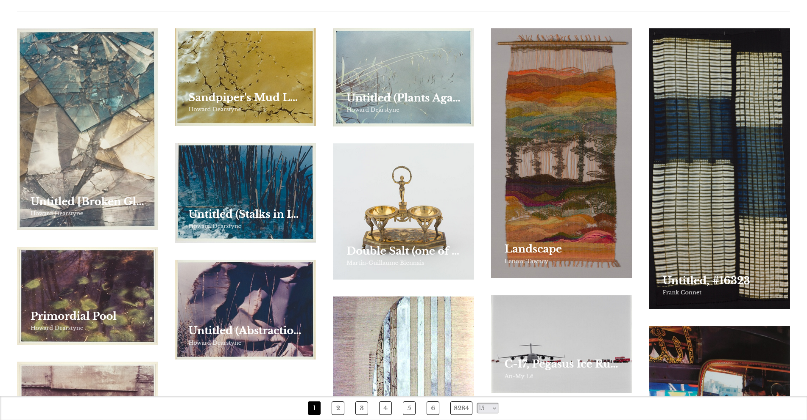
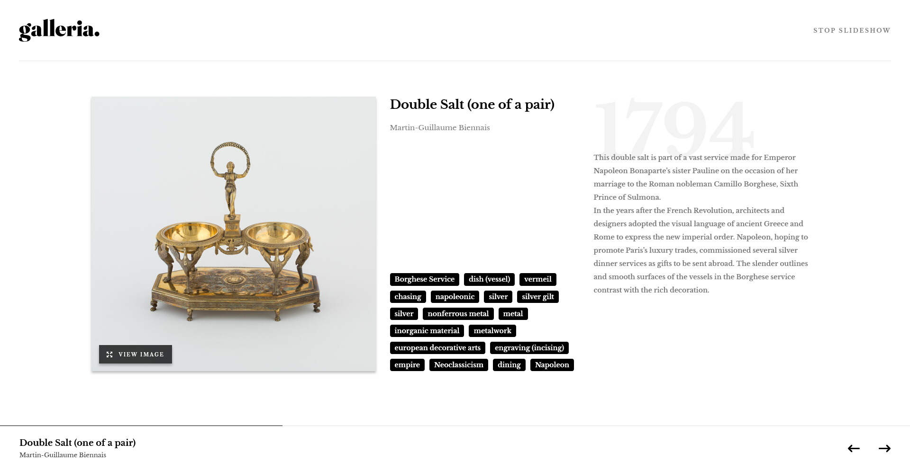

# Galleria slideshow site

Site de apresentação de slides de galeria de arte.
As obras de arte são do [ART INSTITUTE OF CHICAGO](https://www.artic.edu/)

## índice

- [Visão geral](#visão-geral)
   - [O desafio](#o-projeto)
   - [Captura de tela](#capturas-de-tela)
   - [Links](#links)
- [Meu processo](#meu-processo)
   - [Construído com](#construído-com)
- [Autor](#autor)
- [Projeto](#projeto)

## Visão Geral

### O projeto

Os usuários devem ser capazes de:

- [x] Veja o layout ideal do aplicativo dependendo do tamanho da tela do dispositivo
- [x] Veja os estados de foco para todos os elementos interativos na página
- [x] Navegue pela apresentação de slides e veja cada pintura em Lightbox

### Capturas de tela




### Links

- Repositorio GitHub: [Repositorio](https://github.com/Samuel-Amaro/galleria-slideshow-site)
- Resultado: [Resultado](https://galleria-slideshow-site-seven.vercel.app/)

## Meu processo

### Construído com

- HTML
- Web Acessibility(wai-arias, role)
- CSS (Flexbox, Grid, Normalize)
- Mobile-first workflow
- RWD(Responsive Web Design)
- [Svelte](https://svelte.dev/docs/introduction)
- [SvelteKit](https://kit.svelte.dev/docs/introduction)
- [API Art Institute of Chicago](https://api.artic.edu/docs/#introduction)

## Autor

- Site - [Samuel Amaro](https://meu-portfolio-topaz-alpha.vercel.app/)
- Frontend Mentor - [@samuel-amaro](https://www.frontendmentor.io/profile/samuel-amaro)

## Projeto 

### Criado um projeto

como criar um novo projeto sveltekit

```bash
# cria um novo projeto no diretório atual
npm create svelte@latest

# cria um novo projeto em my-app
npm create svelte@latest my-app
```

### Desenvolvimento

Depois de criar um projeto e instalar dependências com `npm install` (ou `pnpm install` ou `yarn`), inicie um servidor de desenvolvimento:

```bash
npm run dev

# ou inicie o servidor e abra o aplicativo em uma nova aba do navegador
npm run dev ---open
```

### Building

Para criar uma versão de produção do seu aplicativo:

```bash
npm run build
```

Você pode visualizar a compilação de produção com `npm run preview`.

Para implantar seu aplicativo, pode ser necessário instalar um [adaptador](https://kit.svelte.dev/docs/adapters) para seu ambiente de destino.

### Scripts

#### Format, Lint, Check

Formatar o código (Prettier)

```bash
npm run format
```

---

Executar o Lint

```bash
npm run lint
```

---

Executar a verificação do Svelte

```bash
npm run check #or
npm run check:watch
```